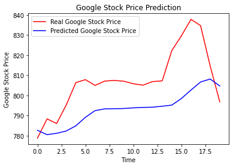

# Recurrent Neural Networks

Recurrent Neural Networks (RNNs) are designed for sequence data. They have connections that form directed cycles, allowing information to persist.

### Key Features:
- **Memory:** Maintain a hidden state to remember previous inputs.
- **Long Short-Term Memory (LSTM):** A variant of RNN designed to remember long-term dependencies.
- **Gated Recurrent Units (GRU):** A variant of RNN similar to LSTM but with a simpler structure.

### Applications:
- Time series forecasting
- Natural language processing
- Speech recognition

## Predict data:

## Datasets:
[Google_Stock_Price_Train.csv](https://www.kaggle.com/datasets/akram24/google-stock-price-train)
[Google_Stock_Price_Test.csv](https://www.kaggle.com/datasets/akram24/google-stock-price-test)

## Additional Reading:
- Andrej Karpathy, 2015, [Visualizing and Understanding Recurrent Networks](cs.nju.edu.cn/wujx/paper/CNN.pdf)
- Klaus Greff, 2015, [LSTM: A Search Space Odyssey](https://arxiv.org/pdf/1503.04069)

